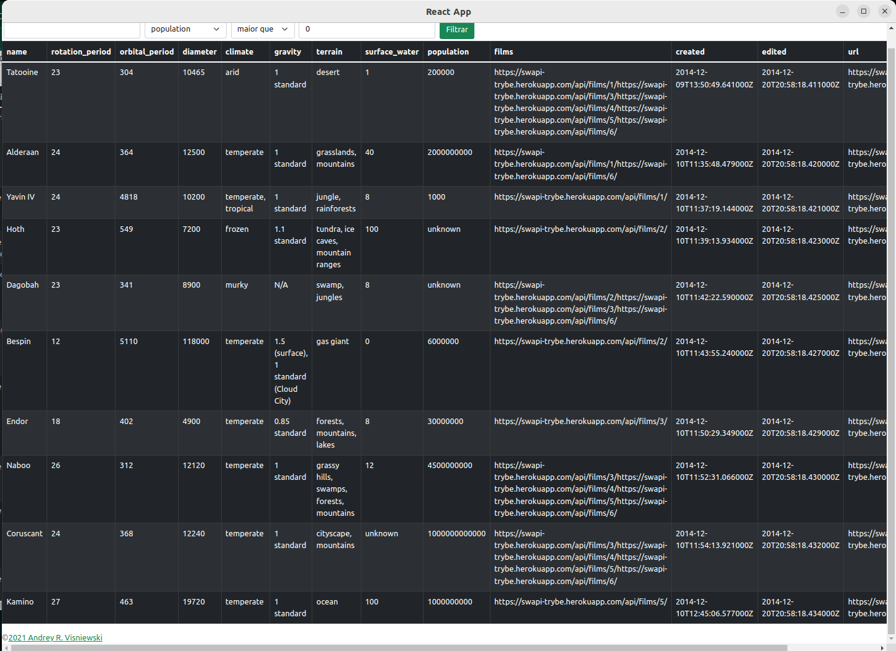

# Starwars Planet Search



## Contexto

Este projeto é uma lista de filtros de planetas do universo Star Wars utiliza Context API e Hooks para controlar estados globais

## Técnologias usadas

Front-end:
> Desenvolvido usando: React, React Hooks, React Context API, Bootstrap

## Instalando Dependências

* clone o repositorio

  ```bash
    git clone git@github.com:Andreyrvs/starwars-planet-search.git
  ```

* instale as dependências:

  ```bash
    npm install
  ```

## Executando aplicação

* Para rodar o front-end:

  ```bash
    npm start
  ```

## Executando Testes

* Para rodar os testes de linter:

  ```bash
    npm run lint
  ```
